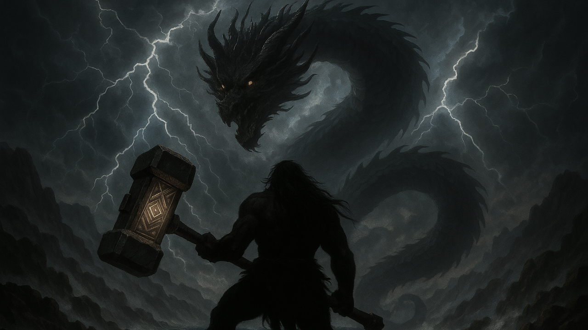

# 단군의 길: *The Way of Dangun*

> 환웅과 웅녀는 혼인하였고  
> 그렇게 초대 단군이 탄생하였다.
> 
> 사계절이 여러 번 바뀌었고  
> 이윽고 17대 단군 선출일이 되었다.
> 
> 환웅의 후손 중 하늘의 시험에 통과한 자는  
> 그 누구든 단군의 자리에 오를 수 있었으니  
> 많은 이들이 자격을 증명하고자 아사달로 모여들었다.  
> 
> "진헌" 또한 그 중 하나였으나  
> 그의 목표는 단군의 계승이 아닌 다른 목적에 있었다.  
> 진헌은 과연 하늘의 시험을 통과할 수 있을까?  

 

## 🎥 게임 플레이 시연 | Gameplay Demo

| 스테이지 1 - _장산범_ |
|:------:|
|  |
| 돌진 & 공격 |
|  |
| 분신 소환 |

 

| 스테이지 2 - _청룡_ |
|:------:|
|  |
| 화염구 & 돌진 |
|  |
| 번개 소환 |

 

## 🕹️ 조작 방법 | Controls

| 기능 | 키 |
|:------:|:-----:|
| 이동 | W / A / S / D |
| 점프 | 스페이스바 |
| 회피 | Shift |
| 근접 공격 | 마우스 좌클릭 |
| 원거리 공격 | 마우스 우클릭 |

 

## 🎮 포트리스 팀원 소개

| Profile | Name | Major | Role | Development | GitHub |
|:--------:|:--------:|:--------:|:--------:|:--------:|:--------:|
|  | **조현우** | 휴먼AI공학전공 | 팀장 | 보스 몬스터 **청룡** | [@ooohyunwooo](https://github.com/ooohyunwooo) |
|  | **조준환** | 게임전공 | 게임 스토리 작가 | 주인공 **진헌** | [@JoJunHwan](https://github.com/JoJunHwan) |
|  | **김민우** | 컴퓨터과학전공 | 프로젝트 통합 관리자 | UI/UX & **스테이지** | [@kmw99](https://github.com/kmw99) |
|  | **강민우** | 휴먼AI공학전공 | 게임 컨셉 디자이너 | 보스 몬스터 **장산범** | [@???](https://github.com/???) |

 

## 🛠️ 개발 환경 | Tech Stack

| 구성 요소 | 기술 |
|:------:|:------:|
| Game Engine |  |
| Language | 	 |
| Version Control |  |
| Documentation |  |
| Communication |  |

 

 

 

 

 

 

 
